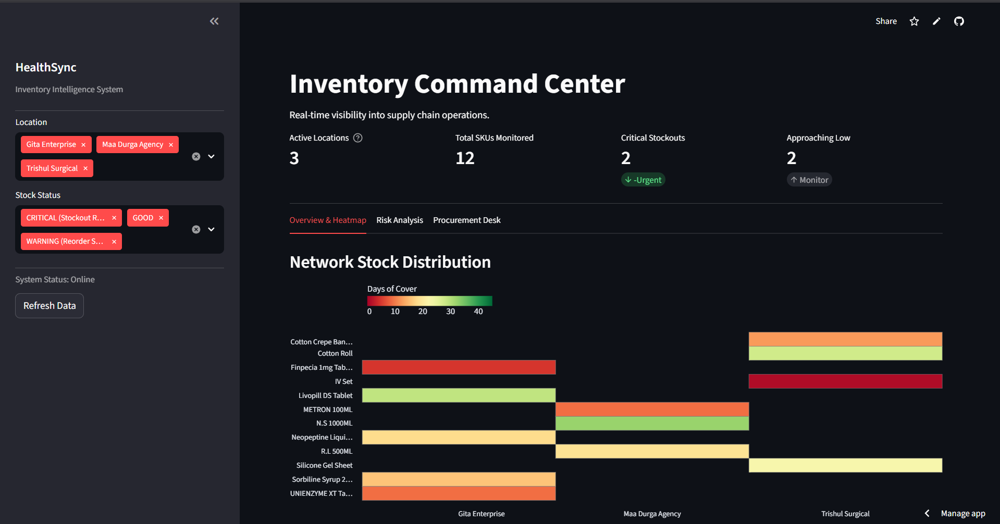
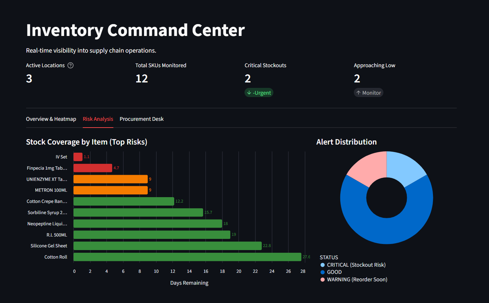
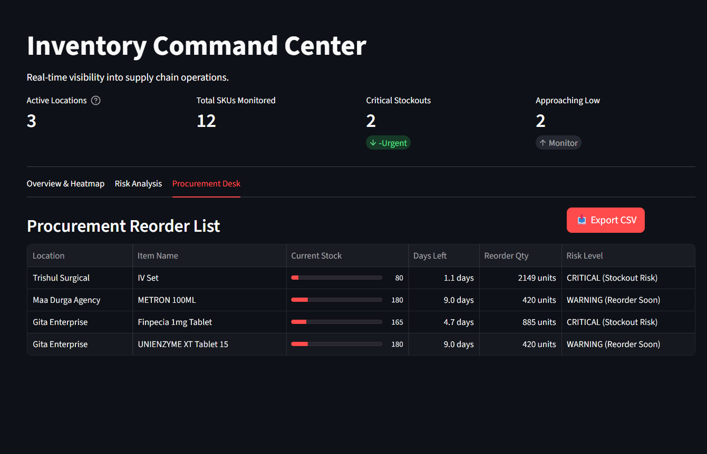

# 🏥 HealthSync: Intelligent Inventory Command Center

> **Eliminating the "Last Mile" supply chain crisis in public health with Snowflake & AI.**

[](https://streamlit.io)
[](https://www.snowflake.com/)
[](https://www.python.org/)

---

## 📖 Table of Contents
- [The Problem](#-the-problem)
- [The Solution](#-the-solution)
- [Key Features & Screenshots](#-key-features--screenshots)
- [How It Works (Architecture)](#-how-it-works-architecture)
- [Technology Stack](#-technology-stack)
- [Installation & Setup](#-installation--setup)
- [Future Roadmap](#-future-roadmap)

---

## 🚨 The Problem
In public health, a stock-out isn't just a logistical error; it is a patient denied critical care. 

Hospitals and NGOs often struggle with:
1.  **Fragmented Data:** Inventory logs live in disconnected spreadsheets or physical registers.
2.  **Reactive Management:** Procurement teams only realize supplies are low when shelves are already empty.
3.  **Waste & Expiry:** Without visibility into "burn rates," some clinics hoard medicine while others run dry.

## 💡 The Solution
**HealthSync** is a unified **Inventory Command Center** that transforms reactive chaos into proactive intelligence. 

By ingesting daily stock logs into **Snowflake**, we use **Dynamic Tables** to automatically calculate burn rates, lead times, and critical thresholds. The data is visualized in a **Streamlit** dashboard that acts as a "Single Source of Truth," allowing procurement officers to spot risks across hundreds of locations instantly.

---

## 📸 Key Features & Screenshots

### 1. The "God's Eye" View (Heatmap)
Instantly visualize stock health across the entire network. The heatmap uses a color-coded scale (Red = Critical, Green = Healthy) to highlight locations that need immediate attention.
* **Active Locations:** See how many sites are reporting.
* **KPI Cards:** Track total SKUs and active critical alerts at a glance.

 


### 2. Risk Analysis & Predictive Modeling
We don't just show current stock; we calculate **"Days Remaining"**. 
* **Top Risks:** A bar chart showing items with the lowest coverage (e.g., "IV Set has only 1.1 days left").
* **Alert Distribution:** A breakdown of how much of your inventory is in the "Danger Zone."




### 3. Actionable Procurement Desk
Data is useless without action. The Procurement Desk automatically generates a **Prioritized Reorder List**.
* **Visual Stock Levels:** Progress bars show stock depth.
* **Smart Reorder Qty:** The system suggests exactly how much to buy to reach safe levels.
* **One-Click Export:** Download a CSV formatted for immediate use by procurement teams.



---

## ⚙️ How It Works (Architecture)

The system follows a modern **ELT (Extract, Load, Transform)** architecture entirely within the Snowflake Data Cloud.

1.  **Ingestion (Data Loading):**
    * Daily stock logs (Location, Item, Received, Issued) are loaded into the `DAILY_STOCK_LOGS` table.
2.  **Transformation (The Brain):**
    * **Snowflake Dynamic Tables** run continuously in the background.
    * They calculate `Avg Daily Usage`, `Lead Time`, and `Days Remaining` automatically.
    * Logic: `Status = CRITICAL` if `Days Remaining < Lead Time`.
3.  **Visualization (The Face):**
    * **Streamlit in Snowflake** queries the processed metrics.
    * The app uses **Altair** for rendering interactive charts and theme-aware CSS for a premium UI.

---

## 🛠 Technology Stack
* **Database:** Snowflake Data Cloud (Warehouses, Databases, Schemas)
* **Data Pipelines:** Snowflake Dynamic Tables (Automated SQL transformations)
* **Frontend Application:** Streamlit (Python-based Web App)
* **Visualization:** Altair & Pandas
* **Language:** Python 3.8+ & SQL

---

## 🚀 Installation & Setup

### Prerequisites
* A Snowflake Account.
* Python installed locally (for testing) or access to Streamlit in Snowflake.

### Step 1: Database Setup
Run the `setup.sql` script (found in this repo) in a Snowflake Worksheet to create the necessary tables and dummy data.

```sql
-- 1. SETUP ENVIRONMENT
CREATE OR REPLACE DATABASE HEALTH_DB;
CREATE OR REPLACE SCHEMA HEALTH_DB.PUBLIC;
CREATE OR REPLACE WAREHOUSE INVENTORY_WH WITH WAREHOUSE_SIZE = 'X-SMALL' AUTO_SUSPEND = 300;

-- 2. CREATE RAW DATA TABLE
CREATE OR REPLACE TABLE DAILY_STOCK_LOGS (
    LOG_DATE DATE,
    LOCATION_ID VARCHAR(50),
    ITEM_NAME VARCHAR(100),
    OPENING_STOCK INT,
    RECEIVED_QTY INT,
    ISSUED_QTY INT,
    CLOSING_STOCK INT,
    LEAD_TIME_DAYS INT
);

-- 3. DUMMY DATA
INSERT INTO DAILY_STOCK_LOGS VALUES
('2023-10-01', 'A Hospital', 'Product A', 1000, 0, 50, 950, 2),
('2023-10-02', 'B Hospital', 'Product B', 950, 0, 60, 890, 2),
('2023-10-03', 'C Hospital', 'Product C', 890, 0, 150, 740, 2),
('2023-10-01', 'Clinic A', 'Product X', 50, 0, 2, 48, 5),
('2023-10-02', 'Clinic B', 'Product Y', 48, 0, 5, 43, 5),
('2023-10-03', 'Clinic C', 'Product Z', 43, 0, 8, 35, 5),

-- 4. CREATE DYNAMIC TABLE 
CREATE OR REPLACE DYNAMIC TABLE INVENTORY_HEALTH_METRICS
TARGET_LAG = '1 minute'
WAREHOUSE = INVENTORY_WH
AS
WITH BASE_DATA AS (
    SELECT 
        LOCATION_ID,
        ITEM_NAME,
        MAX(LOG_DATE) as LAST_REPORT_DATE,
        MAX_BY(CLOSING_STOCK, LOG_DATE) as CURRENT_STOCK,
        ROUND(AVG(ISSUED_QTY), 1) as AVG_DAILY_USAGE,
        MAX(LEAD_TIME_DAYS) as LEAD_TIME
    FROM DAILY_STOCK_LOGS
    GROUP BY LOCATION_ID, ITEM_NAME
)
SELECT 
    *,
    CASE WHEN AVG_DAILY_USAGE = 0 THEN 999 ELSE ROUND(CURRENT_STOCK / AVG_DAILY_USAGE, 1) END as DAYS_REMAINING,
    CASE 
        WHEN (CASE WHEN AVG_DAILY_USAGE = 0 THEN 999 ELSE CURRENT_STOCK / AVG_DAILY_USAGE END) < LEAD_TIME THEN 'CRITICAL (Stockout Risk)'
        WHEN (CASE WHEN AVG_DAILY_USAGE = 0 THEN 999 ELSE CURRENT_STOCK / AVG_DAILY_USAGE END) < (LEAD_TIME * 2) THEN 'WARNING (Reorder Soon)'
        ELSE 'GOOD'
    END as STATUS,
    GREATEST(0, (AVG_DAILY_USAGE * 30) - CURRENT_STOCK) as SUGGESTED_REORDER_QTY
FROM BASE_DATA;
```

### Step 2: Streamlit Configuration
1. Clone this repository.
2. Set up your `streamlit/secrets.toml` with your Snowflake credentials.
3. Run the app locally: `streamlit run app.py`

### Future Roadmap & Improvements
This project is currently a functional MVP (Minimum Viable Product). The following enhancements are planned to make it fully industry-ready:

1. AI-Driven Demand Forecasting:
    * **Current State:** Uses simple average daily usage (ADU).
    * **Future:** Integrate Snowflake Cortex ML to predict seasonal demand spikes (e.g., Flu Season, Monsoon outbreaks) using historical regression models.

2. Smart Notification Layer:
    * **Current State:** Passive dashboard alerts.
    * **Future:** Implement Snowflake External Functions to send automated SMS/WhatsApp alerts to field doctors immediately when stock hits critical levels.

3. Role-Based Access Control (RBAC):
    * **Current State:** Global admin view.
    * **Future:** Separate login views for "Warehouse Managers" vs. "Procurement Officers".

4. Offline-First Data Entry:
    * **Future:** Develop a lightweight mobile PWA for rural clinics with poor internet to log inventory, which syncs to Snowflake when connectivity is restored.

Built with ❤️ for Empowering healthcare heroes with data.