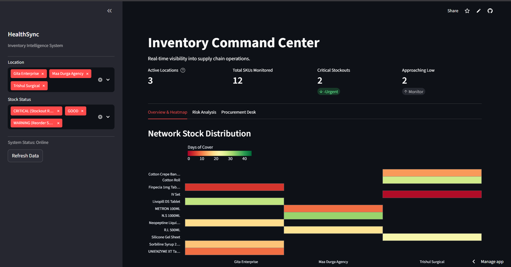
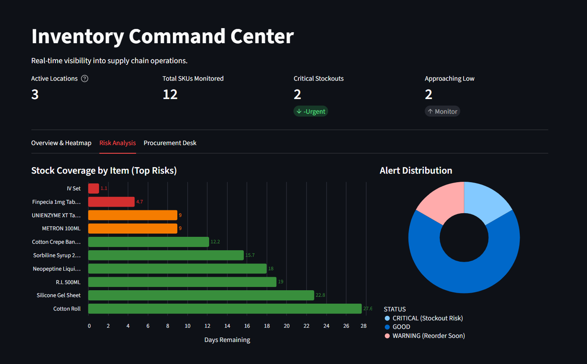
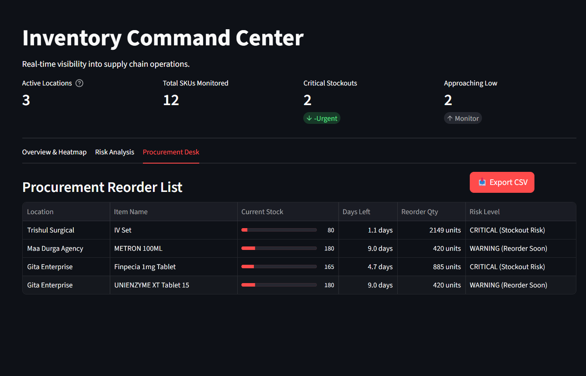

# 🏥 HealthSync: Intelligent Inventory Command Center

> **Eliminating the "Last Mile" supply chain crisis in public health with Supabase & AI.**

[](https://streamlit.io)
[](https://supabase.com/)
[](https://www.python.org/)

---

## 🔗 Live Demo
**Experience the dashboard live here:** [👉 **Click to View HealthSync-Pro**](https://healthsync-pro.streamlit.app/)
*(Note: If the app is in sleep mode, please allow a moment for it to wake up.)*

---

## 📖 Table of Contents
- [The Problem](#-the-problem)
- [The Solution](#-the-solution)
- [Key Features & Screenshots](#-key-features--screenshots)
- [How It Works (Architecture)](#-how-it-works-architecture)
- [Technology Stack](#-technology-stack)
- [Installation & Setup](#-installation--setup)
- [Future Roadmap](#-future-roadmap)

---

## 🚨 The Problem
In public health, a stock-out isn't just a logistical error; it is a patient denied critical care.

Hospitals and NGOs often struggle with:
1.  **Fragmented Data:** Inventory logs live in disconnected spreadsheets or physical registers.
2.  **Reactive Management:** Procurement teams only realize supplies are low when shelves are already empty.
3.  **Waste & Expiry:** Without visibility into "burn rates," some clinics hoard medicine while others run dry.

## 💡 The Solution
**HealthSync** is a unified **Inventory Command Center** that transforms reactive chaos into proactive intelligence.

By ingesting daily stock logs into **Supabase (PostgreSQL)**, we use SQL views to automatically calculate burn rates, lead times, and critical thresholds. The data is visualized in a **Streamlit** dashboard that acts as a "Single Source of Truth," allowing procurement officers to spot risks across hundreds of locations instantly.

---

## 📸 Key Features & Screenshots

### 1. The "God's Eye" View (Heatmap)
Instantly visualize stock health across the entire network. The heatmap uses a color-coded scale (Red = Critical, Green = Healthy) to highlight locations that need immediate attention.
* **Active Locations:** See how many sites are reporting.
* **KPI Cards:** Track total SKUs and active critical alerts at a glance.




### 2. Risk Analysis & Predictive Modeling
We don't just show current stock; we calculate **"Days Remaining"**.
* **Top Risks:** A bar chart showing items with the lowest coverage (e.g., "IV Set has only 1.1 days left").
* **Alert Distribution:** A breakdown of how much of your inventory is in the "Danger Zone."




### 3. Actionable Procurement Desk
Data is useless without action. The Procurement Desk automatically generates a **Prioritized Reorder List**.
* **Visual Stock Levels:** Progress bars show stock depth.
* **Smart Reorder Qty:** The system suggests exactly how much to buy to reach safe levels.
* **One-Click Export:** Download a CSV formatted for immediate use by procurement teams.



---

## ⚙️ How It Works (Architecture)

The system follows a modern **ELT (Extract, Load, Transform)** architecture built on Supabase (PostgreSQL).

1.  **Ingestion (Data Loading):**
    * Daily stock logs (Location, Item, Received, Issued) are loaded into the `daily_stock_logs` table in Supabase.
2.  **Transformation (The Brain):**
    * A PostgreSQL view or materialized view continuously derives metrics.
    * It calculates `avg_daily_usage`, `lead_time`, and `days_remaining` automatically.
    * Logic: `status = CRITICAL` if `days_remaining < lead_time`.
3.  **Visualization (The Face):**
    * **Streamlit** queries the processed metrics via `st.connection("postgresql", type="sql")`.
    * The app uses **Altair** for rendering interactive charts and theme-aware CSS for a premium UI.

---

## 🛠 Technology Stack
* **Database:** Supabase (PostgreSQL)
* **Data Pipelines:** PostgreSQL Views / SQL transformations
* **Frontend Application:** Streamlit (Python-based Web App)
* **Visualization:** Altair & Pandas
* **DB Driver:** SQLAlchemy + psycopg2-binary
* **Language:** Python 3.8+ & SQL

---

## 🚀 Installation & Setup

### Prerequisites
* A [Supabase](https://supabase.com/) account (free tier works).
* Python 3.8+ installed locally.

### Step 1: Database Setup
Run the following SQL in your Supabase SQL Editor to create the necessary tables and seed data.

```sql
-- 1. CREATE RAW DATA TABLE
CREATE TABLE IF NOT EXISTS daily_stock_logs (
    log_date DATE,
    location_id VARCHAR(50),
    item_name VARCHAR(100),
    opening_stock INT,
    received_qty INT,
    issued_qty INT,
    closing_stock INT,
    lead_time_days INT
);

-- 2. SEED DUMMY DATA
INSERT INTO daily_stock_logs VALUES
('2023-10-01', 'A Hospital', 'Product A', 1000, 0, 50, 950, 2),
('2023-10-02', 'B Hospital', 'Product B', 950, 0, 60, 890, 2),
('2023-10-03', 'C Hospital', 'Product C', 890, 0, 150, 740, 2),
('2023-10-01', 'Clinic A', 'Product X', 50, 0, 2, 48, 5),
('2023-10-02', 'Clinic B', 'Product Y', 48, 0, 5, 43, 5),
('2023-10-03', 'Clinic C', 'Product Z', 43, 0, 8, 35, 5);

-- 3. CREATE METRICS VIEW
CREATE OR REPLACE VIEW inventory_health_metrics AS
WITH base_data AS (
    SELECT
        location_id,
        item_name,
        MAX(log_date) AS last_report_date,
        (ARRAY_AGG(closing_stock ORDER BY log_date DESC))[1] AS current_stock,
        ROUND(AVG(issued_qty)::NUMERIC, 1) AS avg_daily_usage,
        MAX(lead_time_days) AS lead_time
    FROM daily_stock_logs
    GROUP BY location_id, item_name
)
SELECT
    *,
    CASE WHEN avg_daily_usage = 0 THEN 999
         ELSE ROUND((current_stock / avg_daily_usage)::NUMERIC, 1)
    END AS days_remaining,
    CASE
        WHEN (CASE WHEN avg_daily_usage = 0 THEN 999 ELSE current_stock / avg_daily_usage END) < lead_time
            THEN 'CRITICAL (Stockout Risk)'
        WHEN (CASE WHEN avg_daily_usage = 0 THEN 999 ELSE current_stock / avg_daily_usage END) < (lead_time * 2)
            THEN 'WARNING (Reorder Soon)'
        ELSE 'GOOD'
    END AS status,
    GREATEST(0, (avg_daily_usage * 30)::INT - current_stock) AS suggested_reorder_qty
FROM base_data;
```

### Step 2: Streamlit Configuration
1. Clone this repository.
2. Install dependencies:
   ```
   pip install -r requirements.txt
   ```
3. Create `.streamlit/secrets.toml` with your Supabase credentials:
   ```toml
   [connections.postgresql]
   dialect = "postgresql"
   host = "db.<your-project-ref>.supabase.co"
   port = 5432
   database = "postgres"
   username = "postgres"
   password = "<your-database-password>"
   ```
4. Run the app locally:
   ```
   python -m streamlit run streamlit_app.py
   ```

---

## 🔮 Future Roadmap
This project is currently a functional MVP. The following enhancements are planned to make it fully industry-ready:

1. **AI-Driven Demand Forecasting:**
    * **Current State:** Uses simple average daily usage.
    * **Future:** Integrate ML models to predict seasonal demand spikes (e.g., Flu Season, Monsoon outbreaks) using historical regression models.

2. **Smart Notification Layer:**
    * **Current State:** Passive dashboard alerts.
    * **Future:** Automated SMS/WhatsApp alerts to field doctors when stock hits critical levels via Supabase Edge Functions.

3. **Role-Based Access Control:**
    * **Current State:** Global admin view.
    * **Future:** Separate login views for "Warehouse Managers" vs. "Procurement Officers".

4. **Offline-First Data Entry:**
    * **Future:** A lightweight mobile PWA for rural clinics with poor connectivity to log inventory, syncing to Supabase when online.

---

Built with ❤️ for Empowering healthcare industry with data.
